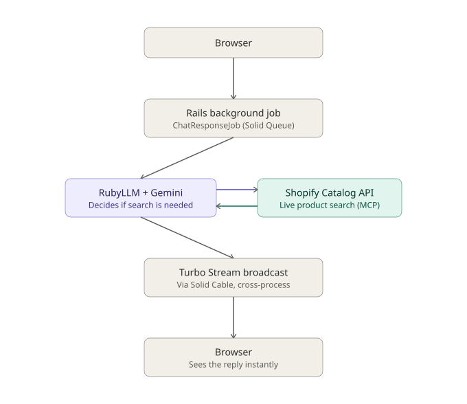

# AI Shop Assistant

An AI-powered shopping assistant built with **Ruby on Rails 8**, **RubyLLM**, and **Google Gemini** — with realtime, no-reload responses via **Hotwire/Turbo Streams**, and live product search against **Shopify's real global Catalog API** instead of seeded fake data.


## What this is

A chat interface where the AI can autonomously decide to search a **live, real product catalog** — not a hardcoded demo dataset — and weave the results into a natural conversation. It's the same tool-calling pattern that powers ChatGPT, Perplexity, and Microsoft Copilot's in-chat shopping features, built from scratch with Ruby.

## What this demonstrates

- **AI tool-calling, not hallucination** — the model calls a real `SearchProducts` tool against Shopify's Catalog API (via MCP + OAuth 2.0 client credentials) rather than inventing product details
- **Realtime streaming without Redis** — responses appear live via Turbo Streams, backed by **Solid Cable** (SQLite-based, not Redis), broadcasting across process boundaries from a background job to the browser
- **Background job processing** — the AI call runs in a **Solid Queue** job, so the request/response cycle stays fast regardless of how long Gemini takes to reply
- **MongoDB via Mongoid, not ActiveRecord** — deliberately chosen for this project; persistence (`Chat#ask`) is hand-written rather than relying on `acts_as_chat`, since that RubyLLM feature is ActiveRecord-only
- **Test-driven throughout** — models, the tool, controllers, and the background job all have RSpec coverage, with RubyLLM/HTTP calls properly stubbed so the suite never hits real APIs
- **Found and reported a real upstream bug** — while integrating the `ruby_llm-mcp` gem, diagnosed a crash in its handling of MCP notification responses and filed [ruby_llm-mcp#155](https://github.com/patvice/ruby_llm-mcp/issues/155) with full reproduction steps; worked around it with a direct HTTP/JSON-RPC implementation

## Architecture



The flow: a browser submits a message → a Rails controller saves it and enqueues a background job (Solid Queue) → the job calls RubyLLM with Gemini → the model decides whether answering needs real product data → if so, it calls the `SearchProducts` tool, which authenticates with Shopify (OAuth 2.0 client credentials) and searches the live global catalog over MCP (JSON-RPC) → Gemini generates a reply → the reply is broadcast live to the browser via Turbo Streams, over Solid Cable so it crosses correctly from the job's process to the browser's open connection.

### Why Solid Cable, not Redis

Action Cable's default `async` adapter only works within a single process's memory — broadcasts from a background job (a separate OS process from the web server) never reach the browser. Solid Cable solves this using the app's own SQLite database instead of a dedicated Redis server, which also means one less paid service to run when deploying to a free-tier host.

## Tech stack

**Backend:** Ruby 4.0, Rails 8.1, MongoDB / Mongoid, RubyLLM, Google Gemini API
**Realtime:** Hotwire (Turbo Streams, Turbo Drive), Solid Cable, Action Cable
**Background jobs:** Solid Queue
**Frontend:** ERB, Tailwind CSS
**Testing:** RSpec, FactoryBot, Shoulda Matchers, Capybara
**External API:** Shopify Catalog API (MCP / JSON-RPC, OAuth 2.0 client credentials)

## Setup

```bash
git clone https://github.com/mjesar/ai_shop_assistant.git
cd ai_shop_assistant
bundle install

cp .env.example .env
# Fill in GEMINI_API_KEY, SHOPIFY_CATALOG_CLIENT_ID, SHOPIFY_CATALOG_CLIENT_SECRET

bin/rails db:prepare   # creates the Solid Queue and Solid Cable SQLite databases
bin/dev                # starts web, css watcher, and job worker together
```

MongoDB must be running locally (`mongod`) — connection settings are in `config/mongoid.yml`.

### Running tests

```bash
bundle exec rspec
```

## Other applications for this pattern

The `SearchProducts` tool is fully decoupled from this project's web UI — the same tool-calling logic could power:

- **A Slack/Discord shopping bot** — same tool, different frontend, no changes needed
- **A price-comparison agent** — searching across merchants for the best price on one item
- **A voice shopping assistant** — paired with speech-to-text/text-to-speech
- **A content tool for writers** — suggesting and embedding live, real product links while drafting
- **A customer support triage bot** — extended with Shopify's Admin API for order-specific lookups
- **A market research agent** — running structured catalog queries at scale for trend analysis

## Engineering notes

- Considered `ruby_llm-mcp` for the Shopify integration, but its `initialize` handshake crashes on this server's notification response format — reported upstream as [#155](https://github.com/patvice/ruby_llm-mcp/issues/155); implemented the integration directly over HTTP/JSON-RPC instead
- Considered the community `ruby_llm-mongoid` gem (early-stage, v0.1.0) but implemented `Chat`/`Message` persistence manually for both learning purposes and stability
- Diagnosed a cross-process broadcast failure (background job's Turbo Stream broadcasts never reaching the browser) and traced it to Action Cable's single-process `async` adapter — fixed by configuring Solid Cable with its own dedicated database
