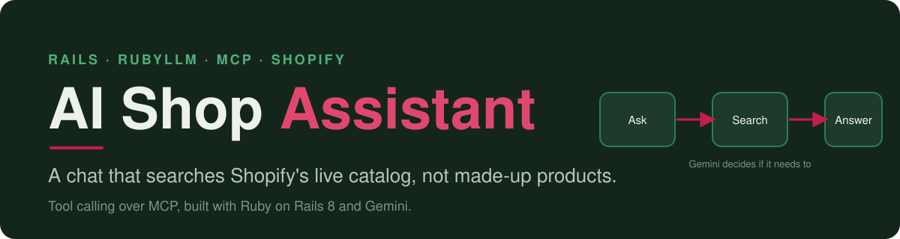
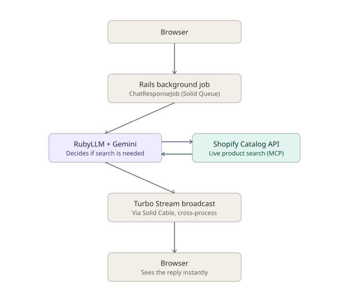
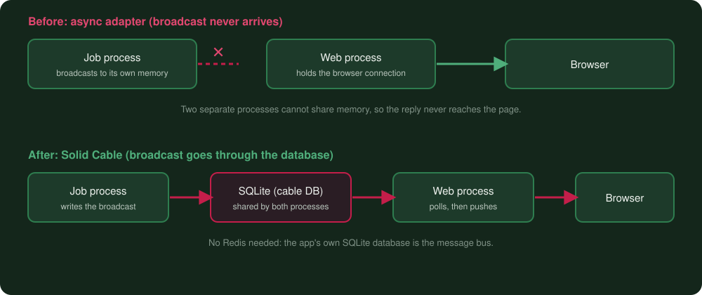

<h1 align="center">
  
</h1>

<p align="center"><strong>A shopping chat where the AI searches Shopify's real catalog instead of making products up.</strong></p>

<p align="center">
  
  
  
  
  
</p>

**AI Shop Assistant is an AI shopping assistant built with Ruby on Rails 8 that shows Rails developers how to give an LLM a real tool: the model decides when to search Shopify's live Global Catalog (through MCP) and answers with real products, prices and links.** It is the same tool calling pattern behind the shopping features in ChatGPT, Perplexity and Copilot, built from scratch in Ruby.

It uses [RubyLLM](https://rubyllm.com) to talk to Gemini, a Solid Queue background job to run the model call, and Hotwire Turbo Streams to show the reply in the browser without a page reload.

## Why this exists

An AI model that has no way to look things up will happily invent a product, a price, or a link. For shopping that is a real problem: a made-up price is worse than no answer.

The fix is tool calling. Instead of letting the model guess, I give it one tool, `SearchProducts`, and let it decide when to use it. When a question needs real product data, the model asks for the tool, the app runs the search against Shopify's live catalog, and the model writes its answer from what came back.

Getting there also taught me two things the tutorials skip:

- A background job and the web server are **separate processes**, so a live reply sent from the job never reached the browser until I changed the Action Cable adapter (see [What keeps it reliable](#what-keeps-it-reliable)).
- The `ruby_llm-mcp` gem crashed on this server's response to the MCP handshake, so I filed [ruby_llm-mcp#155](https://github.com/patvice/ruby_llm-mcp/issues/155) and called the endpoint directly over HTTP.

## See it work

<p align="center">
  
</p>

<details>
<summary>Text version of the diagram</summary>

1. **Browser**: the user types a message and submits it.
2. **Rails background job** (`ChatResponseJob`, run by Solid Queue): the controller saves the message and hands the slow model call to this job, so the web request returns at once.
3. **RubyLLM + Gemini**: the job asks Gemini to answer and decides, through the model, whether a product search is needed.
4. **Shopify Catalog API** (live product search over MCP): if a search is needed, the `SearchProducts` tool gets a token, calls the catalog and returns up to three products.
5. **Turbo Stream broadcast** (through Solid Cable, across processes): the saved reply is broadcast to the browser, which shows it instantly.

</details>

<!-- Video: drag the demo MP4 into GitHub's web editor and paste the user-attachments URL on its own line here. -->

I have not recorded a set of benchmark runs for this project, so there is no results table to show. What I can state from the code is what one tool call returns: up to three products from Shopify's catalog, each reduced to a `title`, a `price` and a `url` (see [`app/tools/search_products.rb`](app/tools/search_products.rb)). Everything the model says about products comes from those three fields.

## How it works

A normal model call is `Question → Answer`. With tool calling it becomes `Question → (maybe) Search → Answer`, and the model chooses whether to search. Here are the steps, with the file that does each one:

1. **Save and enqueue.** [`ChatsController#create`](app/controllers/chats_controller.rb) calls `Chat.start!`, which saves the first message and enqueues a job. It uses the model `gemini-3.5-flash-lite`. Later messages go through [`MessagesController#create`](app/controllers/messages_controller.rb), which returns `head :no_content` straight away.
2. **Run the model in a job.** [`ChatResponseJob`](app/jobs/chat_response_job.rb) calls `Chat#generate_response`, so a slow Gemini reply never blocks a web request. If the chat was deleted meanwhile, the job logs it and skips.
3. **Give the model one tool.** [`Chat#generate_response`](app/models/chat.rb) builds `RubyLLM.chat(model: model_id).with_tool(SearchProducts)`. The model now knows it can ask for a search. Before asking, the job replays the earlier messages of the conversation into the new chat so the model remembers what was said.
4. **Let the model decide.** If the model asks for the tool, `on_tool_call` broadcasts a "searching" status line to the browser ([`messages/_tool_status`](app/views/messages/_tool_status.html.erb)). If it does not need a search, no call is made.
5. **Search the live catalog.** [`SearchProducts`](app/tools/search_products.rb) fetches an OAuth 2.0 client-credentials token from `https://api.shopify.com/auth/access_token` (in [`config/initializers/ruby_llm.rb`](config/initializers/ruby_llm.rb)), then sends a JSON-RPC `tools/call` for `search_catalog` to `https://catalog.shopify.com/api/ucp/mcp`. It returns the first three products.
6. **Save and stream the reply.** The assistant message is saved, and `Message` broadcasts itself with a Turbo Stream ([`app/models/message.rb`](app/models/message.rb)). On any error, the job broadcasts an error message and removes the "searching" line, then re-raises so the failure still shows up in the job dashboard.

Failed and queued jobs can be watched at `/jobs` (Mission Control: Jobs, mounted in [`config/routes.rb`](config/routes.rb)).

## Quick start

```bash
git clone https://github.com/mjesar/ai_shop_assistant.git
cd ai_shop_assistant
bundle install
cp .env.example .env     # add GEMINI_API_KEY and the two Shopify catalog values
bundle exec rspec
```

You need a local MongoDB (`mongod`) running for the app itself. The specs stub RubyLLM and HTTP, so they never call a real API. This is the real output of the last command on my machine:

```
..............

Finished in 1.77 seconds (files took 2.37 seconds to load)
14 examples, 0 failures
```

To run the app, see [Setup](#setup).

## Key terms

- **Tool calling (function calling):** a model cannot browse or query anything on its own. With tool calling you describe a function to it, it replies "please run this with these arguments", your code runs it, and the result goes back to the model.
- **MCP (Model Context Protocol):** an open protocol that lets an AI app call tools on a remote server. Here it is JSON-RPC over HTTP, and the one method used is `tools/call`.
- **Shopify Catalog API:** Shopify's API for searching products across many merchants, the data source for this app. The endpoint used here is the UCP one at `catalog.shopify.com/api/ucp/mcp`.
- **RubyLLM:** a Ruby gem with one interface for many model providers (OpenAI, Anthropic, Gemini and others), including chat and tool calling.
- **Turbo Streams:** Hotwire's way of sending small HTML updates over a WebSocket, so a page changes without a reload.
- **Solid Queue:** the Rails 8 database-backed background job system. It runs `ChatResponseJob`.
- **Solid Cable:** the Rails 8 database-backed Action Cable adapter. It carries broadcasts between processes without Redis.
- **Mongoid:** the MongoDB object mapper for Ruby, used here instead of ActiveRecord for chats and messages.

## Project structure

```
ai_shop_assistant/
├── app/
│   ├── tools/
│   │   └── search_products.rb      <-- the one tool the model can call (Shopify catalog search over MCP)
│   ├── models/
│   │   ├── chat.rb                 <-- builds the RubyLLM chat, replays history, broadcasts tool status and errors
│   │   └── message.rb              <-- a saved message; broadcasts itself with Turbo Streams
│   ├── jobs/
│   │   └── chat_response_job.rb    <-- runs the model call outside the web request
│   ├── controllers/                <-- chats_controller.rb and messages_controller.rb
│   ├── helpers/
│   │   └── messages_helper.rb      <-- render_markdown for assistant replies
│   └── views/{chats,messages}/     <-- chat UI, message, tool status and error partials
├── config/
│   ├── initializers/ruby_llm.rb    <-- Gemini key and the Shopify OAuth token fetch
│   ├── cable.yml, queue.yml        <-- Solid Cable and Solid Queue setup
│   └── mongoid.yml                 <-- MongoDB connection
├── spec/                           <-- RSpec: models, tool, job, request specs, helper
├── assets/readme/                  <-- images used by this README
└── .env.example                    <-- the three keys you need
```

| Spec file | What it covers |
|---|---|
| `spec/models/chat_spec.rb` | Saving the user message, replaying history into a fresh LLM chat, `Chat.start!` |
| `spec/models/message_spec.rb` | Message validations |
| `spec/tools/search_products_spec.rb` | The tool returns products from a stubbed catalog response |
| `spec/jobs/chat_response_job_spec.rb` | The job calls `generate_response` |
| `spec/requests/` | Chats and messages endpoints |
| `spec/helpers/messages_helper_spec.rb` | Markdown rendering |

Folders you can ignore: `bin/`, `config.ru`, `Dockerfile`, `.kamal/`, `public/`, `storage/`, `tmp/` and `log/` are standard Rails 8 boilerplate. `app/mailers/` and `app/views/pwa/` are generated and unused.

## What keeps it reliable

- **Stubbed tests.** All 14 specs stub RubyLLM and HTTP, so the suite is fast and never spends API quota. The trade-off is that they do not prove the live Gemini or Shopify calls work; I check that by running the app.
- **Failure handling.** If the model call raises, the job removes the "searching" status, shows the user a friendly error and re-raises so it stays visible in Mission Control.

**A real failure: replies never reached the browser.** Early on, the chat saved messages but the live reply from the background job never showed up. Action Cable's default `async` adapter keeps broadcasts in one process's memory, and the job runs in a different process from the web server. I switched to Solid Cable, which passes broadcasts through the app's own SQLite database ([`config/cable.yml`](config/cable.yml)).

<p align="center">
  
</p>

<details>
<summary>Text version of the diagram</summary>

**Before (async adapter):** the job process broadcasts into its own memory. The web process, which holds the browser's WebSocket connection, is a different process and never hears it, so the reply never appears.

**After (Solid Cable):** the job process writes the broadcast to a SQLite database that both processes share. The web process polls that database (every 0.1 seconds in [`config/cable.yml`](config/cable.yml)) and pushes the message to the browser. No Redis is needed.

</details>

**A second failure: the assistant forgot the conversation.** Each background job builds a brand new `RubyLLM::Chat`, so on the second message the model had no memory of the first. The fix is in `Chat#generate_response`: it replays the saved messages into the new chat before asking. A spec covers it: it tells the assistant "My name is Alex", then asks "What is my name?" and checks that the earlier turns are replayed.

## Learn more

- [RubyLLM documentation](https://rubyllm.com): tools, chat and providers.
- [Model Context Protocol](https://modelcontextprotocol.io): the protocol behind the catalog call.
- [Shopify Catalog API documentation](https://shopify.dev): Shopify's developer docs.
- [Solid Cable](https://github.com/rails/solid_cable) and [Solid Queue](https://github.com/rails/solid_queue): the Rails 8 database-backed adapters.
- [ruby_llm-mcp#155](https://github.com/patvice/ruby_llm-mcp/issues/155): the upstream bug I filed.

### FAQ

#### How do I add tool calling to a Rails app with RubyLLM?
Subclass `RubyLLM::Tool`, describe it and its parameters, implement `execute`, and attach it with `RubyLLM.chat(...).with_tool(YourTool)`. The model then decides when to call it. [`SearchProducts`](app/tools/search_products.rb) is a working example.

#### How do I call an MCP server from Ruby?
An MCP call over HTTP is a JSON-RPC POST. This app sends `tools/call` with the tool name `search_catalog` and an `Authorization: Bearer` header, using plain `Net::HTTP`. The `ruby_llm-mcp` gem is in the Gemfile, but I do not use it for this call because of the bug in [#155](https://github.com/patvice/ruby_llm-mcp/issues/155).

#### Why do live updates from a background job need Solid Cable or Redis?
Because the job and the web server are separate processes, and the default `async` adapter only broadcasts inside one process. Solid Cable fixes this with a shared SQLite database, as shown [above](#what-keeps-it-reliable).

#### Does this use ActiveRecord?
No. Chats and messages are Mongoid documents in MongoDB. RubyLLM's `acts_as_chat` only works with ActiveRecord, so `Chat` and `Message` persistence is written by hand.

#### How does the assistant avoid inventing products?
It does not rely on memory for product facts. It calls `SearchProducts` and answers from the title, price and URL that come back. This reduces made-up products but does not guarantee the model never mis-words a result.

## Setup

Requirements: Ruby 4.0.4 (see `.ruby-version`), MongoDB running locally, a Gemini API key and Shopify Catalog client credentials.

```bash
git clone https://github.com/mjesar/ai_shop_assistant.git
cd ai_shop_assistant
bundle install
cp .env.example .env     # fill in GEMINI_API_KEY, SHOPIFY_CATALOG_CLIENT_ID, SHOPIFY_CATALOG_CLIENT_SECRET
bin/rails db:prepare     # creates the Solid Queue and Solid Cable SQLite databases
bin/dev                  # web server, Tailwind watcher and job worker together
```

MongoDB connection settings are in `config/mongoid.yml`. Run the tests with `bundle exec rspec`.

## Tech stack

- Ruby 4.0.4 and Rails 8.1
- RubyLLM 1.16 with the Gemini API (`gemini-3.5-flash-lite`)
- Shopify Catalog API over MCP (JSON-RPC), OAuth 2.0 client credentials
- Hotwire (Turbo 2, Stimulus), Action Cable with Solid Cable 4.0
- Solid Queue 1.7 and Mission Control: Jobs for background work
- MongoDB with Mongoid 9.1 (chats and messages), SQLite (queue and cable)
- Tailwind CSS and Redcarpet (Markdown in replies)
- RSpec, FactoryBot, Shoulda Matchers and Capybara for tests

## Status

It works end to end: you can chat, the model can search the live catalog, and replies stream in. It is a learning and portfolio project, not a production store assistant. It returns at most three products per search, it only searches (no cart, checkout or accounts), and the specs stub every external call, so there is no automated check against the live APIs. The repo also has no license file yet, so the code is shared for reading.

## Related work

- [`shop_mcp_server`](https://github.com/mjesar/shop_mcp_server): the other side of MCP, a Rails server that exposes a store to LLMs, with RAG over pgvector.
- [`product_geo_agent`](https://github.com/mjesar/product_geo_agent): a Rails agent that scores how discoverable a Shopify product is to AI assistants.
- [`ucp_catalog`](https://github.com/mjesar/ucp_catalog): a work-in-progress Ruby gem for talking to UCP catalog APIs through one interface.
